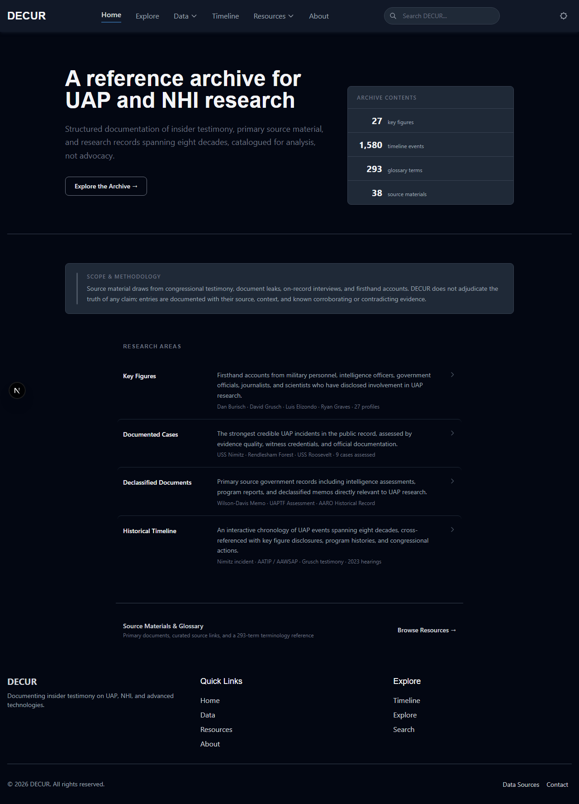
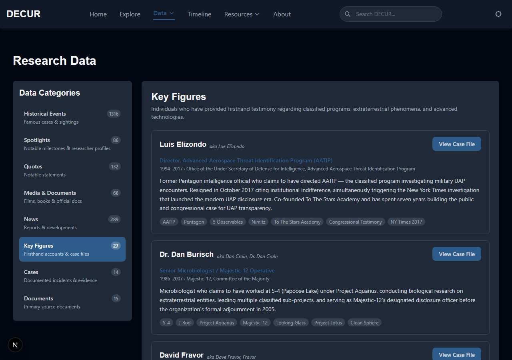
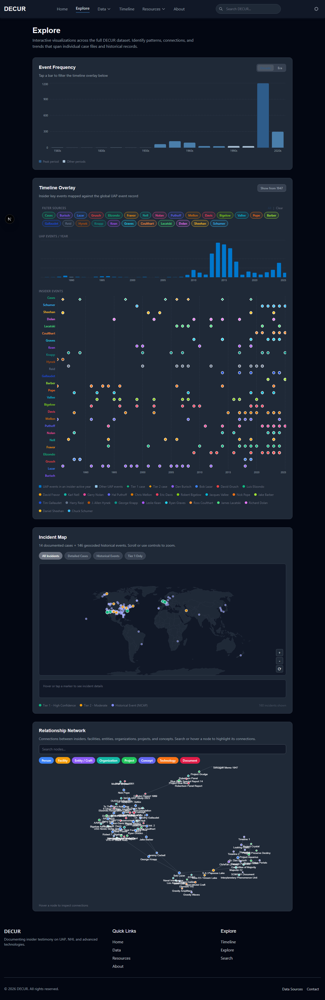

# DECUR

**Data Exceeding Current Understanding of Reality**

A structured reference archive for UAP and NHI research. DECUR catalogs insider testimony, documented incidents, primary source documents, and historical records spanning eight decades - organized for analysis, not advocacy.

Live at [decur.org](https://decur.org)



---

## What DECUR Is

DECUR does not adjudicate the truth of any claim. Every entry is documented with its source, context, and known corroborating or contradicting evidence. The platform draws from congressional testimony, FOIA-released documents, on-record interviews, and firsthand accounts.

---

## Platform Sections

### Data

The core of the platform. Accessed via the `Data` nav dropdown or directly at `/data`.



| Category | Description |
|---|---|
| Historical Events | Documented UAP cases and sightings |
| Key Figures | Researchers, officials, and witnesses |
| Quotes | Notable statements on record |
| Media & Documents | Films, books, and official publications |
| News | Reports and ongoing developments |
| Insiders | Firsthand accounts with full multi-tab profiles |
| Cases | Tier-annotated documented incidents |
| Documents | Annotated primary source documents |

#### Insider Profiles

Each insider has a dedicated multi-tab profile covering background, roles, key events timeline, credibility assessment, network connections, and public disclosures. Current profiles:

- Luis Elizondo (AATIP Director)
- David Fravor (Nimitz Pilot)
- David Grusch (NGA, Intelligence Community Whistleblower)
- Jacques Vallee (Computer Scientist, Researcher)
- Karl Nell (Army Colonel, AARO)
- Hal Puthoff (SRI, AAWSAP)
- Garry Nolan (Stanford Immunologist)
- Bob Bigelow (Bigelow Aerospace, BAASS)
- Eric Davis (EarthTech, AAWSAP)
- Chris Mellon (OUSDI, To The Stars)
- Nick Pope (UK Ministry of Defence, UFO Desk)
- Bob Lazar (S-4 Whistleblower)
- Dan Burisch (Microbiologist, Majestic 12)

Profiles cross-reference documented cases and link into the Explore timeline overlay where applicable.

#### Cases

Tier-annotated documented incidents with witness profiles, evidence inventory, official response tracking, and insider connections.

**Evidence Tiers:**
- Tier 1 - Official documentation (government acknowledgment, declassified records, or on-record military testimony)
- Tier 2 - Strong circumstantial (credible witnesses, partial corroboration)
- Tier 3 - Reported (witness accounts, limited corroboration)

Current cases: Nimitz Tic-Tac, Rendlesham Forest, USS Theodore Roosevelt, Belgian UFO Wave, Iranian F-4 Incident, JAL Flight 1628, Phoenix Lights, O'Hare Airport 2006, USS Omaha USO, Stephenville TX, Shag Harbour, and more.

#### Primary Documents

Annotated primary source documents with authenticity classification, provenance notes, key findings, and insider connections.

**Authenticity Classifications:**
- Official Publication - released through standard government channels
- Declassified (FOIA) - released via Freedom of Information Act request
- Confirmed Leaked - leaked origin confirmed, contents substantiated
- Leaked - Disputed - circulated outside official channels, authenticity contested
- Declassified Authentic - declassified and independently authenticated
- Official Declassified - officially declassified by the originating agency

Current documents: Wilson-Davis Memo, UAPTF Preliminary Assessment (2021), AARO Historical Record Vol. 1 & 2, NASA UAP Study (2023), Halt Memo (1981), DIA Iran F-4 Report (1976), NDAA FY2023 UAP Provisions, Twining Memo (1947), Schulgen Memo (1947), Project SIGN Estimate (1948), and more.

---

### Timeline

A chronological view of 1,580+ documented UAP/NHI events from the 1940s to the present. Filterable by era and event type. Case detail pages link directly into the timeline filtered to the relevant year.

---

### Explore

Interactive cross-dataset visualizations.



- **Event Frequency Chart** - Distribution of documented events by decade and historical era
- **Insider Timeline Overlay** - Swimlane view of insider careers and key events plotted chronologically, with per-source color coding
- **Relationship Network** - Force-directed graph of connections between insiders, organizations, programs, and technologies

---

### Resources

Curated reference materials organized into three tabs:

- **Primary Sources** - Books, films, academic papers, and official publications
- **Testimony & Interviews** - Processed transcripts from congressional hearings, podcasts, and on-record interviews
- **Glossary** - UAP/NHI terminology with definitions and context

---

### Search

Full-text search across all platform content: insider profiles, documented cases, primary documents, timeline events, glossary terms, and resources. Results grouped by content type with direct navigation.

---

## Project Structure

```
components/
  data/            # Data section components (profiles, cases, documents, lists)
  explore/         # Visualization components (charts, network graph, timeline overlay)
  resources/       # Resource list and glossary components
  layout/          # Header, footer, layout wrapper
data/
  *.json           # Static data files (insiders, cases, documents, events, etc.)
  network-graph.ts # Network graph node/link definitions
pages/
  index.tsx        # Home
  data.tsx         # Data section with category routing
  explore.tsx      # Visualizations page
  timeline.tsx     # Timeline page
  resources.tsx    # Resources page
  about.tsx        # About page
public/            # Static assets
styles/            # Global CSS
types/
  data.ts          # TypeScript interfaces (CategoryType, CaseEntry, DocumentEntry, etc.)
```

---

## Tech Stack

- **Framework**: Next.js (Pages Router) with TypeScript
- **Styling**: Tailwind CSS
- **Charts**: Recharts
- **Network Graph**: react-force-graph-2d
- **Data**: Static JSON with `getStaticProps` + ISR (`revalidate: 3600`)
- **Analytics**: Vercel Analytics
