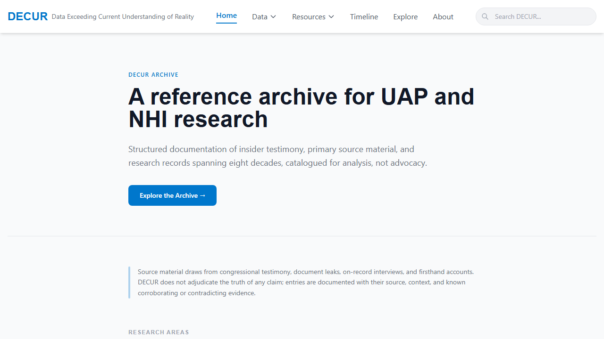
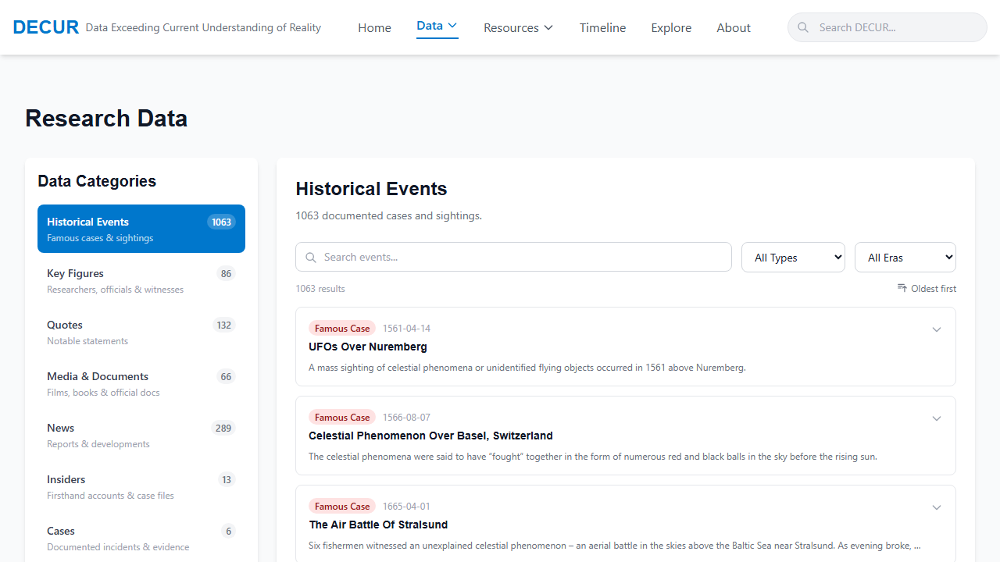
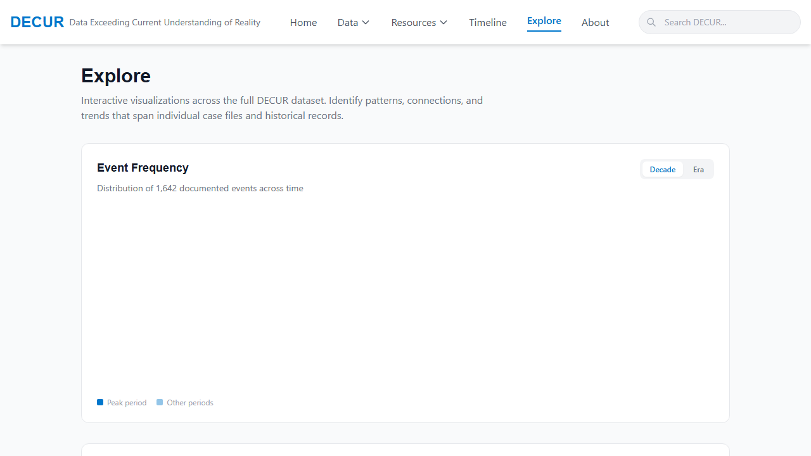

# DECUR

**Data Exceeding Current Understanding of Reality**

A structured reference archive for UAP and NHI research. DECUR catalogs insider testimony, documented incidents, primary source documents, and historical records spanning eight decades - organized for analysis, not advocacy.



---

## What DECUR Is

DECUR does not adjudicate the truth of any claim. Every entry is documented with its source, context, and known corroborating or contradicting evidence. The platform draws from congressional testimony, FOIA-released documents, on-record interviews, and firsthand accounts.

---

## Platform Sections

### Data

The core of the platform. Accessed via the `Data` nav dropdown or directly at `/data`.



| Category | Description | Count |
|---|---|---|
| Historical Events | Documented UAP cases and sightings | 1,063 |
| Key Figures | Researchers, officials, and witnesses | 86 |
| Quotes | Notable statements on record | 132 |
| Media & Documents | Films, books, and official docs | 66 |
| News | Reports and developments | 289 |
| Insiders | Firsthand accounts with full profiles | 13 |
| Cases | Tier-annotated documented incidents | 6 |
| Documents | Annotated primary source documents | 7 |

#### Insider Profiles

Each insider has a dedicated multi-tab profile covering their background, role, key claims, credibility assessment (supporting and contradicting evidence), network connections, and known disclosures. Current profiles:

- Luis Elizondo (AATIP Director)
- David Fravor (Nimitz Pilot)
- David Grusch (NGA, Intelligence Community Whistleblower)
- Jacques Vallee (Computer Scientist, Researcher)
- Karl Nell (Army Colonel, AARO)
- Hal Puthoff (SRI, AAWSAP)
- Garry Nolan (Stanford Immunologist)
- Bob Bigelow (Bigelow Aerospace, BAASS)
- Eric Davis (EarthTech, AAWSAP)
- Chris Mellon (OUSDI, To The Stars)
- Nick Pope (UK Ministry of Defence, UFO Desk)
- Bob Lazar (S-4 Whistleblower)
- Dan Burisch (Microbiologist, Majestic 12)

#### Cases

Six high-evidence documented incidents with tier classification, witness profiles, evidence inventory, official response tracking, and insider connections.

**Evidence Tiers:**
- Tier 1 - Official documentation (government acknowledgment, declassified records, or on-record military testimony)
- Tier 2 - Strong circumstantial (credible witnesses, partial corroboration)
- Tier 3 - Reported (witness accounts, limited corroboration)

Current cases: Nimitz Tic-Tac, Rendlesham Forest, USS Theodore Roosevelt, Belgian UFO Wave, Iranian F-4 Incident, JAL Flight 1628.

#### Primary Documents

Seven annotated primary source documents with authenticity classification, provenance notes, key findings, and insider connections.

**Authenticity Classifications:**
- Official Publication - released through standard government channels
- Declassified (FOIA) - released via Freedom of Information Act request
- Leaked - Disputed - circulated outside official channels, authenticity contested
- Confirmed Leaked - leaked origin confirmed, contents substantiated

Current documents: Wilson-Davis Memo, UAPTF Preliminary Assessment (2021), AARO Historical Record Vol. 1, NASA UAP Study (2023), Halt Memo (1981), DIA Iran F-4 Report (1976), NDAA FY2023 UAP Provisions.

---

### Timeline

A chronological view of documented UAP/NHI events spanning from the 1940s to the present. Filterable by era and event type.

---

### Explore

Interactive cross-dataset visualizations.



- **Event Frequency Chart** - Distribution of 1,642+ documented events by decade or historical era
- **Insider Timeline Overlay** - Swimlane view of all 13 insider careers and key events plotted chronologically
- **Relationship Network** - Force-directed graph of connections between insiders, organizations, programs, and technologies

---

### Resources

Curated reference materials organized into three tabs:

- **Materials** - Books, films, academic papers, and official publications
- **Transcripts** - Processed interview and hearing transcripts
- **Glossary** - UAP/NHI terminology with definitions and context

---

## Development

### Prerequisites

- Node.js 18+
- npm

### Setup

```bash
npm install
npm run dev
```

Open [http://localhost:3000](http://localhost:3000).

### Commands

```bash
npm run dev        # Start development server (port 3000)
npm run build      # Build production bundle
npm run start      # Start production server
npm run lint       # Run ESLint
npm run typecheck  # Run TypeScript type checking
npm run check      # Run lint + typecheck together
```

---

## Project Structure

```
components/
  data/            # Data section components (profiles, cases, documents, lists)
  explore/         # Visualization components (charts, network graph, timeline overlay)
  resources/       # Resource list and glossary components
  layout/          # Header, footer, layout wrapper
data/
  *.json           # Static data files (insiders, cases, documents, events, etc.)
  network-graph.ts # Network graph node/link definitions
pages/
  index.tsx        # Home
  data.tsx         # Data section with category routing
  explore.tsx      # Visualizations page
  timeline.tsx     # Timeline page
  resources.tsx    # Resources page
  about.tsx        # About page
public/            # Static assets
styles/            # Global CSS
types/
  data.ts          # TypeScript interfaces (CategoryType, CaseEntry, DocumentEntry, etc.)
```

---

## Tech Stack

- **Framework**: Next.js (Pages Router) with TypeScript
- **Styling**: Tailwind CSS
- **Charts**: Recharts
- **Network Graph**: react-force-graph-2d
- **Data**: Static JSON with `getStaticProps` + ISR (`revalidate: 3600`)
