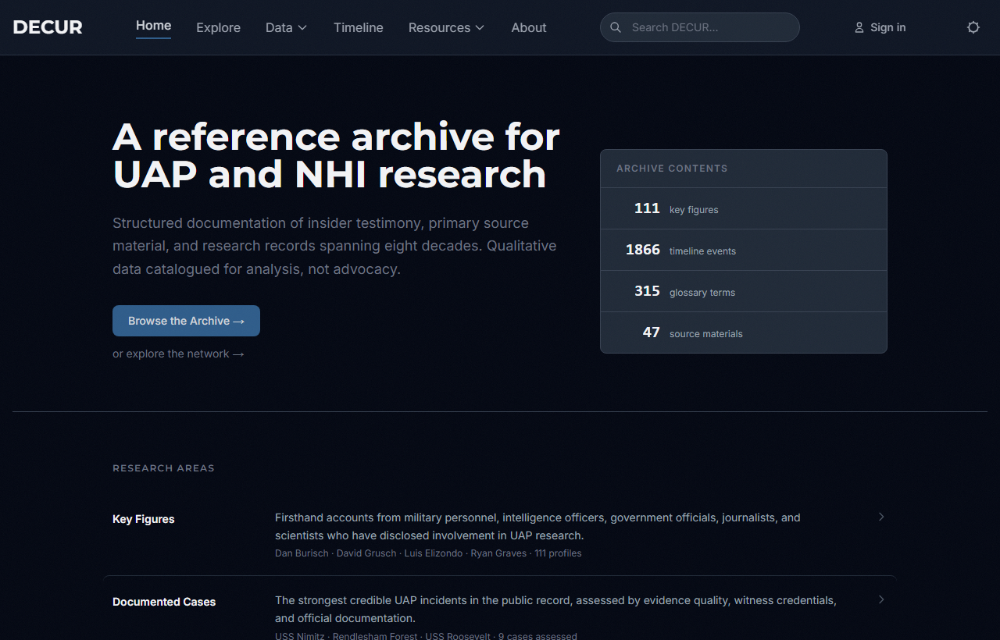
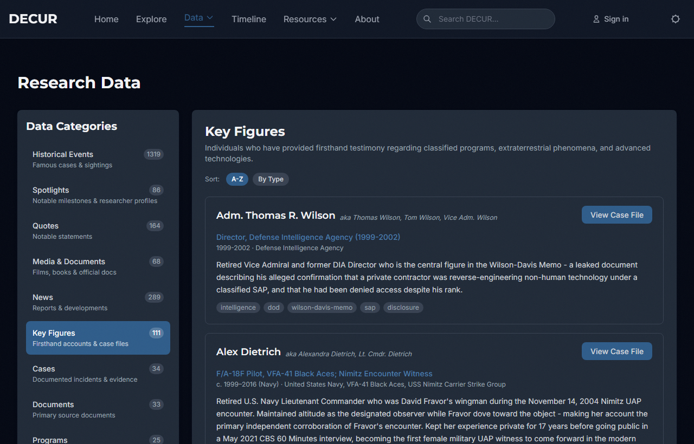
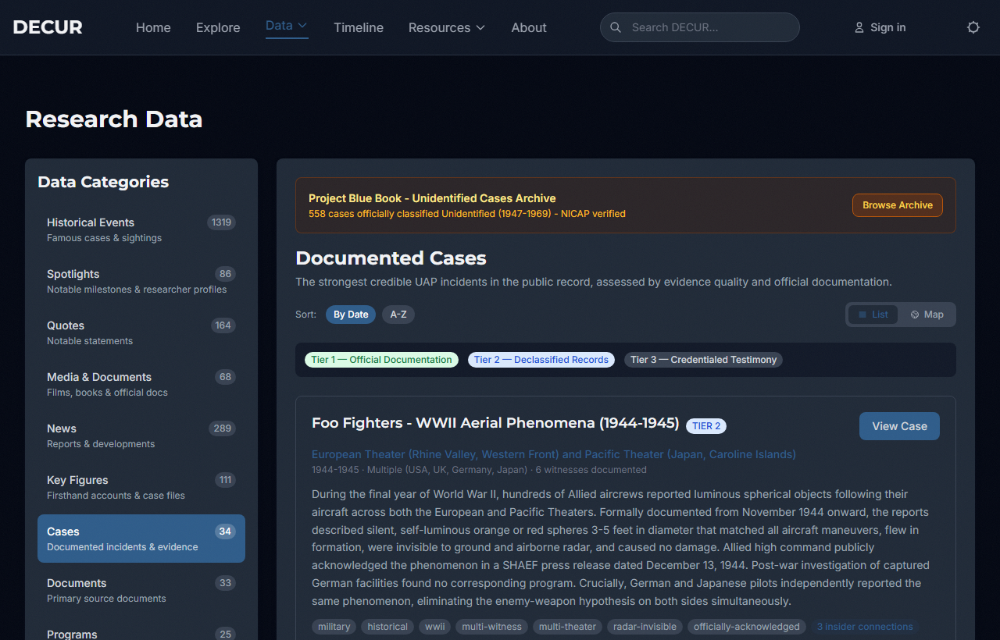
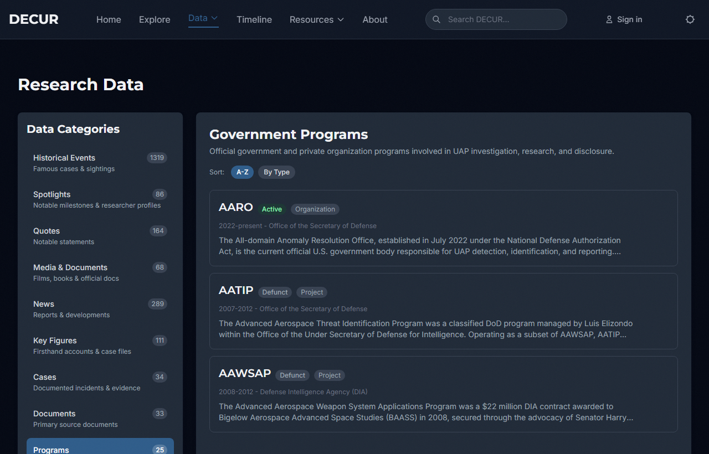
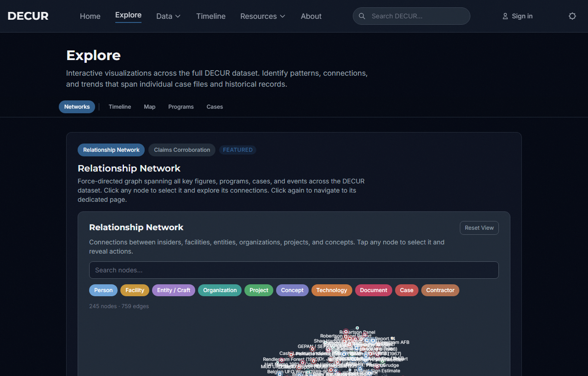
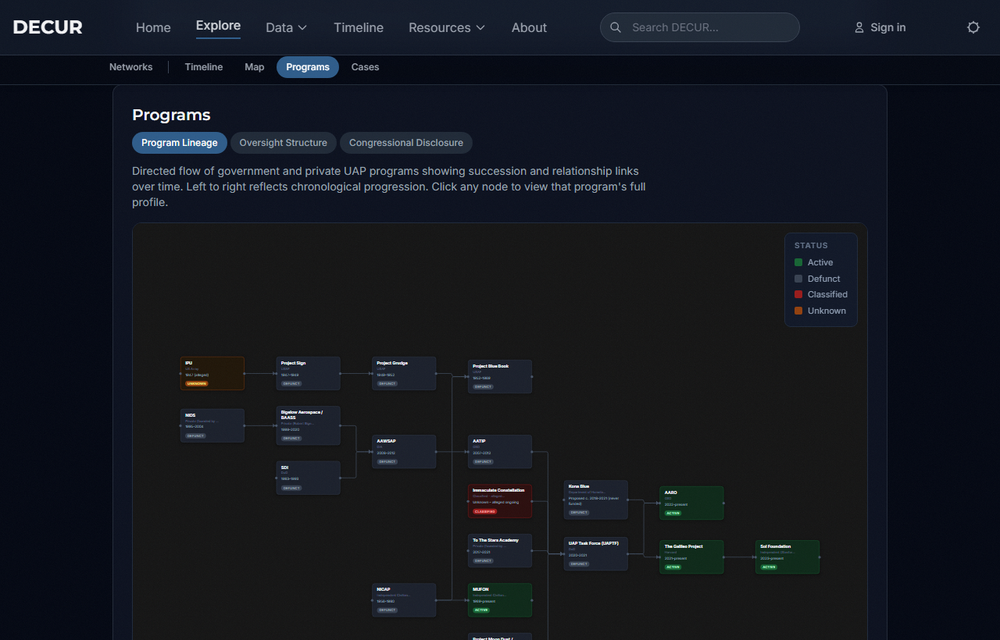
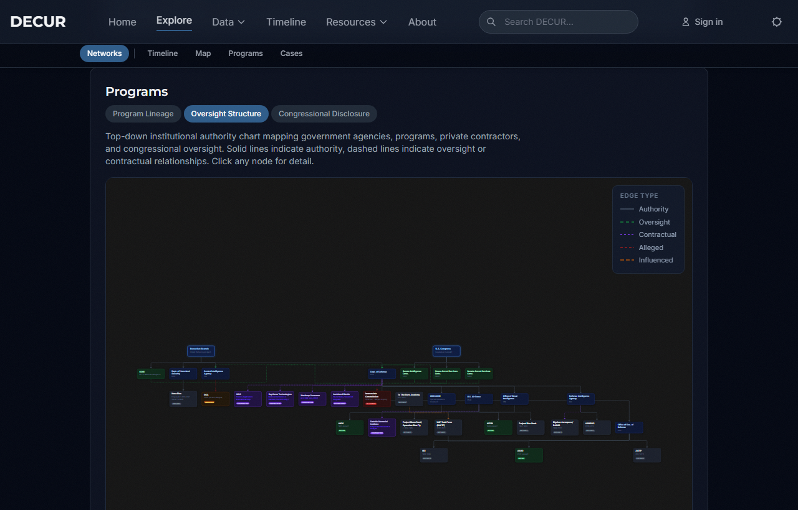
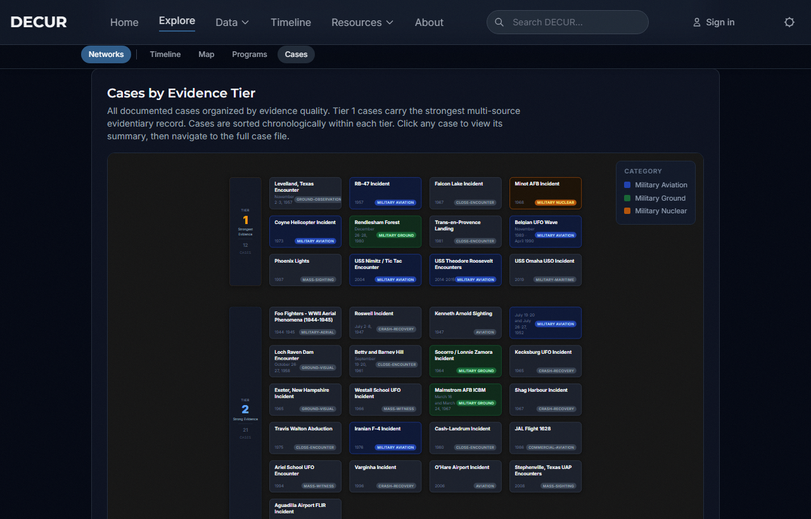

# DECUR

**Data Exceeding Current Understanding of Reality**

A structured reference archive for UAP and NHI research. DECUR catalogs insider testimony, documented incidents, primary source documents, and historical records spanning eight decades. Qualitative data catalogued for analysis, not advocacy.

Live at [decur.org](https://decur.org)



---

## What DECUR Is

DECUR does not adjudicate the truth of any claim. Every entry is documented with its source, context, and known corroborating or contradicting evidence. The platform draws from congressional testimony, FOIA-released documents, on-record interviews, and firsthand accounts.

---

## Platform Sections

### Data

The core of the platform. Accessed via the `Data` nav dropdown or directly at `/data`.



| Category | Description |
|---|---|
| Historical Events | Documented UAP cases and sightings |
| Spotlights | Notable milestones and disclosure events |
| Key Figures | Researchers, officials, and witnesses with full multi-tab profiles |
| Quotes | Notable statements on record |
| Media & Documents | Films, books, and official publications |
| News | Reports and ongoing developments |
| Cases | Tier-annotated documented incidents |
| Documents | Annotated primary source documents |
| Programs | Government programs, organizations, and private defense contractors |

#### Key Figure Profiles

Each figure has a dedicated multi-tab profile covering background, roles, key events timeline, credibility assessment, network connections, and public disclosures. The platform currently profiles 111+ figures across six categories: government insiders, scientists, pilots, journalists, officials, and executives.

Profiles cross-reference documented cases and link into the Explore timeline overlay where applicable.

#### Cases



Tier-annotated documented incidents with witness profiles, evidence inventory, official response tracking, and insider connections.

**Evidence Tiers:**
- Tier 1 - Official documentation (government acknowledgment, declassified records, or on-record military testimony)
- Tier 2 - Strong circumstantial (credible witnesses, partial corroboration)
- Tier 3 - Reported (witness accounts, limited corroboration)

Current cases: Nimitz Tic-Tac, Rendlesham Forest, USS Theodore Roosevelt, Belgian UFO Wave, Iranian F-4 Incident, JAL Flight 1628, Phoenix Lights, O'Hare Airport 2006, USS Omaha USO, Stephenville TX, Shag Harbour, and more.

#### Primary Documents

Annotated primary source documents with authenticity classification, provenance notes, key findings, and insider connections.

**Authenticity Classifications:** Official Publication, Declassified (FOIA), Confirmed Leaked, Leaked - Disputed, Declassified Authentic, Official Declassified.

#### Programs & Contractors



Government and private-sector organizations with UAP research relevance. Program entries include key personnel, timeline events, significance assessments, and source citations.

A dedicated **Private Defense Contractors** section covers Lockheed Martin (Skunk Works), Northrop Grumman (incl. TRW), Raytheon Technologies, Battelle Memorial Institute, SAIC, and EG&G - each with documented contracts, UAP-relevant claims labeled by evidence status (testified under oath, documented, alleged, disputed), connected figures, and sources.

---

### Timeline

A chronological view of 1,800+ documented UAP/NHI events spanning 1561 to the present. Filterable by era and event type. Case detail pages link directly into the timeline filtered to the relevant year.

---

### Explore

Interactive cross-dataset visualizations. The page uses a hero + tabbed layout: two network graphs occupy the hero, with four additional visualizations in tabs below.

#### Network Graphs (Hero)

Two force-directed graph views toggle in the hero section:

**Relationship Network** - Connections between insiders, organizations, programs, and technologies. Nodes are color-coded by type; clicking a node navigates to the associated profile or detail page.



**Claims Corroboration Network** - Bipartite force graph linking key figures to the claim categories they have made (e.g., crash retrieval, non-human intelligence, reverse engineering). Category node size scales with the number of corroborating figures. Filter by verification status; click any node for a side panel listing witness claims or figure disclosures.

#### Tabbed Secondary Visualizations

**Timeline** - Swimlane view of insider careers and key events plotted chronologically with per-source color coding, plus distribution of documented events by decade and historical era.

**Programs tab** - Three sub-views toggled by pill buttons:

**Program Lineage Flow**



Left-to-right directed graph showing chronological succession and influence between UAP investigation programs - from Project Sign (1947) through AARO (2022-present). Click any node for a detail panel with program summary, key personnel, and a link to the full program profile.

**Organizational Oversight Hierarchy**



Top-down authority hierarchy spanning the Executive Branch, DoD, CIA, Congressional committees, and UAP programs - with private defense contractors shown as contractual leaf nodes. Five edge types visualize distinct relationship classes: authority (solid), oversight (dashed green), contractual (dotted purple), alleged (dashed red), and influenced (dashed amber). Click any non-branch node for a detail panel.

**Congressional Disclosure Timeline** - Chronological flow of key congressional disclosure milestones, hearings, and legislative actions. Click any node for event detail.

**Cases tab**

**Evidence Tier Swimlane**



Horizontal swimlane layout organizing all documented cases by evidence tier. Cases are sorted chronologically within each band and color-coded by incident category (military-aviation, military-ground, civilian, maritime, etc.). Click any case card for a summary panel and direct link to the full case profile.

---

### User Accounts

Authenticated users get a personal workspace on top of the research archive.

**Authentication**
- Email + password sign-up with verified email flow (custom branded confirmation email via Resend)
- One-click sign-in with Google or GitHub OAuth
- Secure password reset and email change flows
- Persistent sessions across tabs and devices

**Profile (`/profile`)**

Three-tab personal dashboard:

- **Saved Items** - Bookmark any figure, case, document, program, or timeline event and view them in one place
- **Collections** - Organize bookmarks into named collections; toggle public/private and share via link
- **Submissions** - Track contribution submissions through the moderated review pipeline with live status updates and reviewer notes

**Contribute (`/contribute`)**

Authenticated users with verified email can submit new data for moderator review:
- Key figure profiles, documented cases, timeline events, corrections, and source additions
- Type-specific wizard with field validation
- Moderator review queue with approve/reject/revision workflow
- Submission audit trail and Discord notifications on new submissions

---

### Project Blue Book Archive

Searchable index of all 12,618 Project Blue Book cases (1947-1969), sourced from the National Archives digitization. Filter by year, location, and case status (Unidentified, Insufficient Data, Other). Each entry links to the original NARA document where available.

---

### Resources

Curated reference materials organized into three tabs:

- **Primary Sources** - Books, films, academic papers, and official publications
- **Testimony & Interviews** - Processed transcripts from congressional hearings, podcasts, and on-record interviews
- **Glossary** - UAP/NHI terminology with definitions and context

---

### Search

Full-text search across all platform content: insider profiles, documented cases, primary documents, timeline events, glossary terms, and resources. Results grouped by content type with direct navigation.

---

## Project Structure

```
components/
  data/            # Data section components (profiles, cases, documents, lists)
  explore/         # Visualization components (network graph, xyflow, charts)
  resources/       # Resource list and glossary components
  layout/          # Header, footer, layout wrapper
data/
  key-figures/        # Per-figure JSON profiles (~60 files) + index.json + registry.ts
  network-graph.ts    # Relationship network node/link definitions
  claims-network.ts   # Claims corroboration bipartite graph data
  org-hierarchy.json  # Oversight hierarchy nodes and edges
  contractors.json    # Private defense contractor profiles
  cases.json          # Documented UAP cases
  timeline.json       # 1,800+ historical events
  programs.json       # Government and private programs
  documents.json      # Primary source documents
  resources.json      # Curated reference materials
  glossary.json       # UAP/NHI terminology
  blue-book-index.json # Project Blue Book case index
pages/
  index.tsx        # Home
  data.tsx         # Data section with category routing
  explore.tsx      # Visualizations page (hero + tabbed layout)
  timeline.tsx     # Timeline page
  blue-book.tsx    # Project Blue Book archive
  search.tsx       # Full-text search
  resources.tsx    # Resources page
  sources.tsx      # Primary sources
  about.tsx        # About page
public/            # Static assets and screenshots
types/
  data.ts          # TypeScript interfaces
```

---

## Tech Stack

- **Framework**: Next.js (Pages Router) with TypeScript
- **Styling**: Tailwind CSS
- **Auth & Database**: Supabase (PostgreSQL, Row-Level Security, OAuth via Google/GitHub)
- **Email**: Resend (transactional email from noreply@decur.org)
- **Flow Visualizations**: @xyflow/react with @dagrejs/dagre layout engine
- **Charts**: Recharts
- **Network Graph**: react-force-graph-2d
- **Data**: Static JSON with `getStaticProps` + ISR (`revalidate: 3600`)
- **Analytics**: Vercel Analytics
